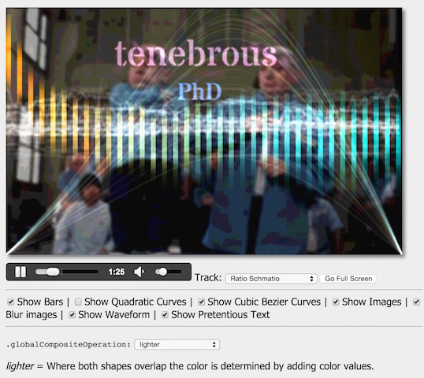
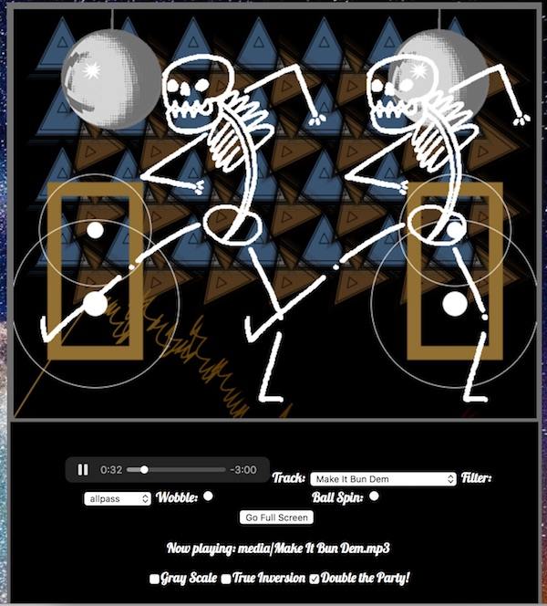
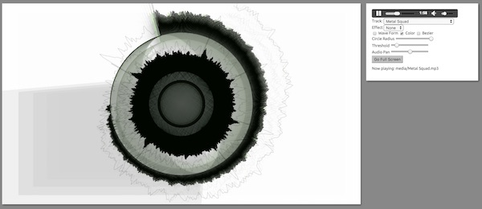
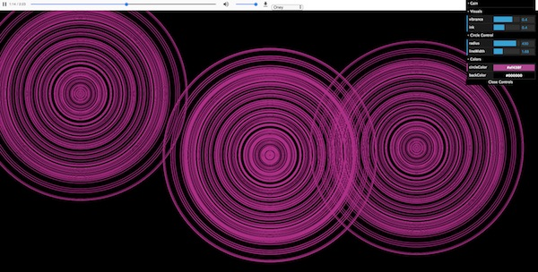

# Project 1 - Audio Visualizer - *DRAFT*

I. [Overview](#I)
  
  - A. [Mission](#mission)
  - B. [Resources](#resources)
  - C. [Examples](#examples)
  
II. [Project Requirements](#II)
  
  - A. [Functionality](#functionality)
  - B. [Design & Interaction](#design)
  - C. [Canvas API & Experience](#canvas)
  - D. [WebAudio API & Experience](#webaudio)
  - E. [HTML/CSS & Media](#media)
  - F. [Code](#code)
  - G. [Impact](#impact)

III. [Documentation](#III)

IV. [Grading](#IV)

V. [Submission](#V)

VI. [Screenshots](#VI)

## I. Overview

 

- A) Your mission:
  - First, get a partner, and post both of your names to the discussion thread in mycourses. If you like, give your team a name. A partner is optional, you may work solo if you wish
  - *Both* partners must contribute *both* JavaScript code AND HTML/CSS to the project. This is NOT a project where team members are allowed to specialize into "Art Director" and "Software Developer" roles! Both team members shall be "Artist/Coders" (doing both) for this project
  - In this project you will build on the Web Audio Visualizer ICE and create a unique interactive audio visualization experience that utilizes the Web Audio and Canvas APIs:
  - This could be a great portfolio piece for you - so give it your best effort!
  - Ideally the experience will run in all modern browsers, but at a bare minimum it must run in recent versions of Chrome
  - The assignment is graded out of 100 points. An A grade will be awarded only for meeting the requirements below, AND going sufficiently "above and beyond" the what we did in the Audio Visualizer ICE
  - You will be evaluated on:
    - the quality of the experience you create
    - the soundness of your programming
    - meeting the requirements detailed below
    - how far you went beyond what we did in class, as described below
    
 
    
- B) Resources:
  - [HW - Audio Visualizer - Part I](https://github.com/tonethar/IGME-330-Master/blob/master/notes/HW-AV-1.md)
  - [HW - Audio Visualizer - Part II](https://github.com/tonethar/IGME-330-Master/blob/master/notes/HW-AV-2.md)
  - [HW - Audio Visualizer - Part III](https://github.com/tonethar/IGME-330-Master/blob/master/notes/HW-AV-3.md) - *there is no dropbox for this and it will not be collected. But this is where some very helpful info on adding audio effect nodes to the visualizer (which is a requirement of the final project submission) is given to you.*
  - [Web Audio Demo](https://github.com/tonethar/IGME-330-Master/blob/master/notes/demo-web-audio-1.md)
  - [Canvas Image Data Demo](https://github.com/tonethar/IGME-330-Master/blob/master/notes/demo-canvas-image-data.md)
  - [More Web Audio](https://github.com/tonethar/IGME-330-Master/blob/master/notes/demo-more-web-audio.md)
  - [Week 5A - Tuning up our Audio Visualizers](https://github.com/tonethar/IGME-330-Spring-2019/blob/master/weekly/week-05A-notes.md)
  - [Week 6A - JavaScript ES5 *Revealing Module Pattern*](https://github.com/tonethar/IGME-330-Spring-2019/blob/master/weekly/week-06A-notes.md)
  
 

 - C) Examples:
   - [Project 1 Showcase Video (2181)](https://video.rit.edu/Watch/Si56JxGd) - projects are shown starting at 5:00
   - Here are some examples from 2171 & 2175 (most run best in Chrome):
     - https://mcs2515.github.io/Magical_Visualizer/#
     - https://people.rit.edu/lpn4937/330/project1/audioVisualizer.html
     - https://people.rit.edu/bev4807/330/exercises/audio-visualizer-project/audio-visualizer-project.html
     - https://people.rit.edu/rep4975/330/project1/audio_visualizer.html
     - https://people.rit.edu/etn6701/330/Project%201/
     - https://people.rit.edu/pfw4498/330/projects/audioViz/wilsonAudioVizProject.html
     - https://people.rit.edu/sbm7101/330/projects/MayerWalker_AudioViz/WalkerMayer_AudioViz.html
     - https://people.rit.edu/bfc6072/330/projects/Project1_Audio_Visualizer/Audio_Visualizer.html
     - https://people.rit.edu/tjc3255/330/audio-visualizer/audio-visualizer-project.html
     - http://igm.rit.edu/~acjvks/courses/2015-fall/330/demos/p1-demo/web-audio-example.html
   - 2165 and older:
     - Disco Skeleton --> https://people.rit.edu/arw2013/prototype/Prototype2.html
     - Conway's Game of Life Visalizer --> https://www.csh.rit.edu/~aidan/audioVisualizer/index.html
     - https://people.rit.edu/las3914/330/project_01/audio-visualizer/
 

## II. Project Requirements

### A. Functional Requirements
1. Required Controls:
    - The &lt;audio> element and its progress indicators, and standard play, pause, scrub, and volume controls. Optionally, you are allowed to omit this element and create custom controls that give the same functionality
    - At least 3 sliders
    - At least 3 checkboxes
    - At least 1 radio button group
    - A way to choose between at least 3 distinct audio tracks
    - A "fullscreen" button
2. Be sure that the default settings of these controls results in an app that starts up in a visually pleasing state
3. There will be no JavaScript errors or exceptions thrown by the app
4. Ideas for optional controls:
    - Make your entire UI minimalist by using dat.gui instead of standard DOM controls --> http://workshop.chromeexperiments.com/examples/gui/#1--Basic-Usage
    - Mouse control (clicking or moving the mouse changes how the visualizer looks)
    - Web Cam input changes how the visualizer looks
    - The user can load their own tracks using [HTML Drag and Drop API](https://developer.mozilla.org/en-US/docs/Web/API/HTML_Drag_and_Drop_API) or the [HTML `File` API](https://developer.mozilla.org/en-US/docs/Web/API/File)
    

### B. UI Design & Interaction
- ***Throw out the AV exercise and start over. You may NOT reuse the HTML and CSS from that exercise. Instead, build a custom layout yourself.***

1) Pleasing graphic design:
    - with a custom interface coded in HTML/CSS, by you
    - this interface does not resemble the AV homework's UI
    - it MUST utilize a CSS framework or modern web layout technology - see section D. below
2) Widgets are well labeled and follow interface conventions, for example:
    - radio buttons are for mutually exclusive options, checkboxes are for when you want to let the user choose *multiple* options --> https://delib.zendesk.com/hc/en-us/articles/203430309-Radio-button-vs-checkbox-what-s-the-difference-
3) Users should be able to figure out how to use the app with minimal instruction, and user errors must be handled gracefully:
    - be sure to provide instruction and tooltips if necessary
    - setting the `title` attribute of an element gives us a tooltip - easy!

### C. Canvas API  & Experience
1) Bitmap info fetched with `ctx.getImageData()` - will be manipulated with "Photoshopish" effects and then displayed to the user in some way using `ctx.putImageData()` -  ideally the user will be able to control or toggle the effects on and off. 
2) Audio data (frequency or waveform) must be sampled and used to draw graphics on the canvas using the following methods:
    - Lines
    - Bezier and Cubic Bezier curves (see [SG-2](https://github.com/tonethar/IGME-330-Master/blob/master/notes/HW-SG-2.md))
    - Circles/Ovals
    - A gradient will be used in at least one `fill()` or `stroke()` operation (see SG-2)
    - Rectangles
    - Bitmapped Images (optional)
3) Use drawing context state variables where appropriate such as `.strokeStyle`, `.fillStyle`, `.lineWidth`, `.lineCap`, `.lineJoin`, `.globalAlpha` etc ...
4) Use the canvas transforms where appropriate - `ctx.translate()`, `ctx.rotate()` and `ctx.scale()`
    - "Push" and "pop" the canvas drawing state where appropriate
    - Recall that if your functions manipulate any drawing state variables, it's a good idea to `ctx.save()` the drawing state at the top of the function, and `ctx.restore()` the state at the bottom of the function
5) Be sure that all of the above are implemented in an *aesthetically pleasing* fashion and are not merely tacked on to meet a requirement

### D. Web Audio API & Experience
1) Give the user the ability to view both the frequency AND the waveform data (not necessarily simultaneously)
2) Add at least one audio effect node (besides the analyser), and give the user the ability to manipulate it
3) Be sure that the effect is *aesthetically pleasing* and not merely tacked on to meet a requirement

### E. HTML/CSS & Media
1) Valid HTML5 - https://validator.w3.org
    - Use HTML5 semantic and structural elements where practical
2) Valid CSS - https://jigsaw.w3.org/css-validator/
    - Most CSS is in an external style sheet.
3) Images are properly *optimized* (both dimensions and file size) for Web delivery
4) Embedded Web Font (but *Open Sans* is prohibited) - use https://fonts.google.com or similar
5) You MUST use either a CSS framework or a modern web layout technology for the UI of this project:
  - CSS Frameworks:
    - https://bootstrap-vue.js.org
    - http://getbootstrap.com
    - http://materializecss.com
    - https://purecss.io
    - https://github.com/troxler/awesome-css-frameworks
  - Modern Web Layout Technologies:
    - [CSS Flexbox](https://developer.mozilla.org/en-US/docs/Learn/CSS/CSS_layout/Flexbox)
    - [CSS Grid](https://developer.mozilla.org/en-US/docs/Learn/CSS/CSS_layout/Grids)

### F. Code Requirements
1) Conventions and structure:
    - All code is an external JavaScript files
    - `let` and `const` must be used by defualt to declare variables - only use `var` for optimizations
    - D.R.Y. - Don't Repeat Yourself. Repeated blocks of nearly identical code must be factored out and placed in a separate function
    - Variable and function names must begin with a lowercase letter
    - Well-commented code. Each and every function gets a comment indicating what it does
2) The use of the ES5 *Revealing Module Pattern* is required
3) It is expected and required that the code in the assignment (other than from approved libraries) is written by you. If you do end up using a small amount of code you found on the web, you must document where you got it from.  Give credit and a link for all code (fragments or otherwise) that are not written you. Failing to give credit opens you to charges of **academic dishonesty**:
   - examples of acceptable use for this project:
     - copying and lightly modifying code for an emboss effect - https://www.i-programmer.info/programming/graphics-and-imaging/2078-canvas-bitmap-operations-bitblt-in-javascript.html?start=2
     - copying and lightly modifying code for a "hamburger" menu - https://www.google.com/search?q=vanilla+javascript+hamburger+menu
   - Cite the code source **both** in the source code itself as a comment, and in your final documentation
   - Be sure to make borrowed code "your own" as much as possible for example by simplifying or improving the clarity of the code,  using `let` or `const` instead of `var`, getting rid of inline event handlers (which are prohibited in this project) and so on
   - You do not need to cite code that you received from our in-class exercises, demos or HW
   - **If you have any doubt about what is acceptable to "borrow", ask the professor *in advance* of using it**
3) **NOT allowed**:
    - jQuery
    - inline event handlers in your HTML
    - `console.log()` calls (delete or comment them out)

### G. Impact
  - Does the app functionality and programming go beyond what we did in class?
  - Is there an analogous relationship between the sound data and what people are seeing on the screen?
  - Is this project "portfolio quality" that you would not hesitate to show a potential employer?
  - Project elements are implemented in an aesthetically pleasing fashion and are not merely tacked on to meet a requirement
  - Be sure that the app functions as expected when posted to `banjo.rit.edu` - for example, be sure that there are not any security issues caused by using `http` instead of `https` in links to libraries and so on
  - Ideas to increase impact:
    - Review [Week 5A - Tuning up our Audio Visualizers](../weekly/week-05A-notes.md#effective-audio-visualizer)
    - If your Audio Visualizer doesn't periodically change your users might get bored. Not all effects need be user controllable. Consider having certain effects toggle on and off or change every 5 to 10 seconds or so
    - Your drawing doesn't have to be on a black background like the Audio Visualizer ICE is
    - Certain drawing could go beyond the raw data for the various bins (frequency ranges), it could instead be aggregate data such as average loudness of all frequencies, or changes in the average of certain frequencies, or tied to beat detection.
    - Moving sprites (like in SG-2) and in our in-class demos could change their direction/speed/behavior based on user control or the characteristics of the audio data
    - You can use `ctx.scale()` to squash or stretch shapes - to create ovals for example
    - The Audio Visualizer ICE redraws the entire canvas every turn. Consider NOT doing so, and allowing drawing to accumulate on the canvas - a moving sprite drawing a trail for example - and then the entire layer either slowly fading or being wiped and started over.
    - The above could be implemented on a second canvas like we did in the Paint Part II ICE. This second canvas could also be toggled on and off by the user.
    - Not everything has to be drawn at 60 frames/second - use `setInterval()` or similar to achieve this 
    - Consider using motion detection or face tracking data to influence your visualization

## III. Documentation
  -  Both team members will individually submit final docs
    - It's a good idea to document things as you are working on the project
    - Consider setting up a google doc right away so that you can posts links and other information there as you are working.
 - Elucidate how you met the 7 categories of requirements, and be specific about any extras you did - i.e. where you went "above and beyond"
 - Discuss what went right and what went wrong. List what features you would have liked to add to the project if you'd had more time/energy
 - Declare any non-course resources (libraries, sounds, images, tutorials, sample code) you utilized, in both your code comments, and in the final documentation of the project. Note: You don't have to document that you used the code I gave you in class.
- Precisely detail the contributions of each partner to the overall project.
- Grade yourself, your partner, and the overall project and justify it. Use a grade of 0-100%.
 

## IV. Grading (\*TO DO\*)

Your project will be graded on the following criteria:

| Criteria | Weight | Your Score |
| -------- | ------ | ---------- |
| **A. [Functionality](#functionality)** | **15** | |
|    1. Has required Controls | |
|    2. Runs without errors | |
|    3. Starts in a pleasing state | |
|    - *Missing controls* | *(-5 each)* |
|    - *Errors* | *(-? depending on severity)* |
| **B. [Design & Interaction](#design)** | **15** | |
|    1. Visual design is pleasing | |
|    2. Widgets are well labeled and follow interface conventions | |
|    3. Users should be able to figure out how to use the app with minimal instruction | |
|    4. The app should look good on a range of displays. | |
|    - *Interface is clean and functional but not particularly attractive* | *(-1 to -5)* |
|    - *Interface looks like AV HW* | *(-15)* |
|    - *Interface "broken" at 1024x768 resolution* | *(-10)* |
| **C. [Canvas API & Experience](#canvas)**  | **15** | |
|    - *Missing required elements | *(-5 each)* |
| **D. [WebAudio API & Experience](#webaudio)**  | **15** | |
|    - *Missing required elements | *(-5 each)* |
| **E. [HTML/CSS/Media](#media)**  | **5** | |
|    1. Valid HTML | |
|    2. Valid CSS | |
|    3. Images properly optimized | |
| **F. [Code](#code)**  | **5** | |
|    1. *Conventions NOT followed* | *(-1 to -5)* |
| **G. [Impact](#impact)**  | **25** | |
|    - Is the app work as intended and visually engaging? | |
|    - Does the app functionality and programming go beyond what we did in class? | |
|    - Is this project "portfolio quality" that you would not hesitate to show a potential employer? | |
|    - *Project is NOT portfolio quality* | *(-5 to -15)* |
| **Above and Beyond (You need to document this)** | **5** | |
| **Possible Total Points** | **100** | |
| **Deductions** | **&darr; Don't lose points for any of these! &darr;** | |
| *Deduction if missing an embedded font* | *(-5)* | |
| *Deduction if missing a CSS framework or modern web layout* | *(-10)* | |
| *Deduction if missing ES5 Revealing Module Pattern* | *(-10)* | |
| *Deduction if required prototype is not submitted to dropbox on time* | *(-10)* | |
| *Deduction if final and complete documentation is not submitted to dropbox on time* | *(-10)* | |

Note:
- **Good** (Meet all requirements above reasonably well) = 90%
- **Better** (Go beyond expectations in 2 or more areas) = 95%
- **Best** (Go significantly beyond expectations in 2 or more areas) = 100%

## V. Milestones & Project Submission
  - Get a partner, and post both of your names to the discussion thread in mycourses
  - Project working prototype - at least 50% or so "done"
    - see myCourses for due date/time & submission instructions
    - one submission per team please. Make sure both team members' names are included
  - Final project deliverable - see myCourses for due date/time and submission instructions. One submission per team please. Again, make sure both team member's names are included
  

  
## VI. Screenshots
  

   

